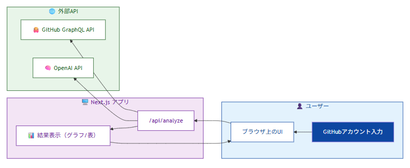
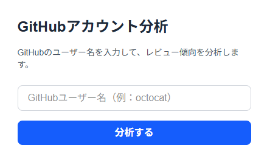
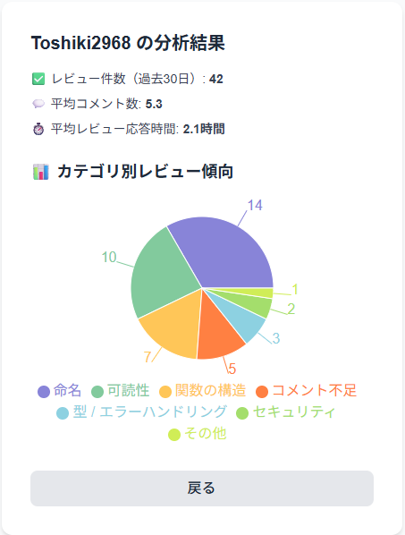

# GitHub レビューコメント分析アプリ

## 1. 概要

チームのコードレビューにおいて「同じ指摘を何度も受けている開発者がいる」という課題がありました。
このアプリは、その課題に対処するため、GitHub 上のレビューコメントをもとに指摘傾向をカテゴリ別に可視化し、
自己改善やレビュー品質の向上に役立てることを目的としています。

## 2. システム構成図

## 3. 画面一覧

### (1) GitHub アカウント入力画面

- 概要

  - 対象ユーザーの GitHub アカウントを入力します
  - 入力後、公開リポジトリのレビュー履歴を取得・分析します

- 画面イメージ
  

### (2) 分析結果画面

- 概要

  - 対象ユーザーが受けたレビューコメントを取得し、カテゴリごとに分類します
    - 命名（変数名・関数名など）
    - 可読性（インデント・複雑さ）
    - 関数の構造（処理の分離・関数長）
    - コメント不足
    - 型 / エラーハンドリング
    - セキュリティ
    - その他
  -
  - カテゴリ分類には OpenAI API を使用します
  - 分類された結果は、レーダーチャートやグラフ形式で可視化されます
  - 代表的なレビューコメントも一覧で表示されます

- 画面イメージ

  

## 4. 使用技術

今回は、フロントエンドとバックエンドを完全に分離するほどの規模ではないと判断しました。
当初は Next.js を採用する必要性は低いと考えていましたが、今後の画面数や機能の増加を見越し、App Router によるルーティングの簡素化や保守性の観点から Next.js を採用しました。

また、レビューコメントの文脈を正確に理解し、適切にカテゴリ分類するために、文脈理解に優れた GPT モデルを使用しています。

- フロントエンド: Next.js
- API 連携: GitHub GraphQL API / OpenAI GPT API
- データ可視化: Recharts / Chart.js
- データベース: MongoDB

## 5. 今後の展望

- 指摘の経時的変化（改善傾向）の表示
- 自分と他ユーザーの比較グラフ
- PR 作成時の改善ポイント自動サジェスト
- Github ログインに対応
