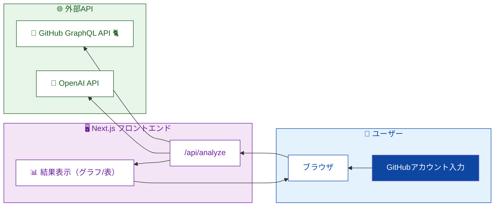

```mermaid
graph RL
    subgraph User["👤 ユーザー"]
        Browser["ブラウザ"]
        Input["GitHubアカウント入力"]
    end

    subgraph Frontend["🖥️ Next.js フロントエンド"]
        View["📊 結果表示（グラフ/表）"]
        AnalyzeAPI["/api/analyze"]
    end

    subgraph ExternalAPI["🌐 外部API"]
        GitHub["🐙 GitHub GraphQL API 🐈"]
        OpenAI["🧠 OpenAI API"]
    end


    Input --> Browser
    Browser --> AnalyzeAPI
    AnalyzeAPI --> GitHub
    AnalyzeAPI --> OpenAI
    AnalyzeAPI --> View
    View --> Browser

    style User fill:#E3F2FD,color:#0D47A1,stroke:#0D47A1
    style Frontend fill:#F3E5F5,color:#6A1B9A,stroke:#6A1B9A
    style ExternalAPI fill:#E8F5E9,color:#1B5E20,stroke:#1B5E20

    style Browser fill:#FFFFFF,color:#0D47A1,stroke:#0D47A1
    style Input fill:#0D47A1,color:#FFFFFF
    style AnalyzeAPI fill:#FFFFFF,color:#6A1B9A,stroke:#6A1B9A
    style View fill:#FFFFFF,color:#6A1B9A,stroke:#6A1B9A
    style GitHub fill:#FFFFFF,color:#1B5E20,stroke:#1B5E20
    style OpenAI fill:#FFFFFF,color:#1B5E20,stroke:#1B5E20
```
